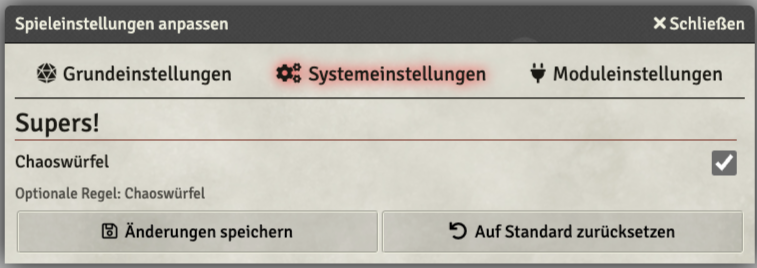

# Supers! deutsche Version - FoundryVtt

## Installation

### via Manifest-URL

[https://github.com/RackNarDev/supers-rpg-foundryvtt/releases/latest/download/system.json](https://github.com/RackNarDev/supers-rpg-foundryvtt/releases/latest/download/system.json)

### Lokale Installation

Das Verzeichnis _supers_ nach ```{FOUNDRY VERZEICHNIS}/Data/systems/``` kopieren.

```
FOUNDRY VERZEICHNIS
├── Config
│   ...
├── Data
│   ├── modules
│   │   ...
│   ├── systems
│   │   ├── README.txt
│   │   └── supers 
│   ├─ worlds
│   │  ...
└── Logs
```

## Projektsetup

Das Projekt verzichtet zum derzeitigen Zeitpunk bewust auf weitere Abhängigkeiten und Build-Prozesse.

## Für die (Spielleitung)

### Konfiguration



##     

## Für die Spieler

## Für Entwickler

### Projektstruktur

### Neue Handlebarsfunktionen


